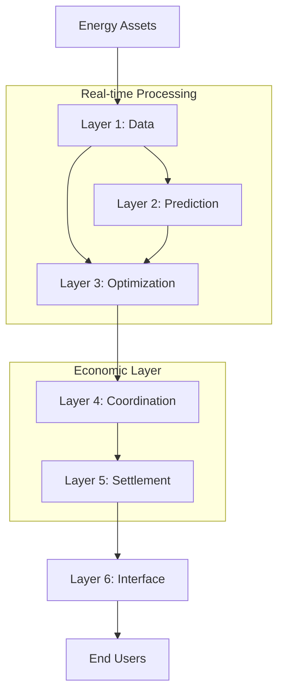

# Architecture Overview

The Qubit Foundation employs a comprehensive six-layer architecture designed to handle the full lifecycle of energy data - from ingestion and processing to optimization and user interaction. Each layer builds upon the previous, creating a robust, scalable infrastructure for the energy transition.

## The Six-Layer Stack

<Steps>
  <Step title="Layer 1: Data Foundation">
    **Standardization and Ingestion**
    
    The foundational layer that establishes common data models and ingests information from diverse energy sources.
    
    - **Schemas**: Universal JSON Schema definitions for all energy data types
    - **Connectors**: Protocol-specific adapters for MQTT, OCPP, Modbus, and more
    - **Adapters**: Data transformation, normalization, and validation
    
    *Status: In Production*
  </Step>
  
  <Step title="Layer 2: Prediction Engine">
    **AI-Powered Forecasting**
    
    Advanced machine learning models that predict energy generation, consumption, and grid conditions.
    
    - Time-series forecasting for renewable generation
    - Load prediction and demand response modeling
    - Grid stability and fault detection
    - Market price forecasting
    
    *Status: In Development*
  </Step>
  
  <Step title="Layer 3: Optimization Engine">
    **Intelligent Resource Management**
    
    Mathematical optimization algorithms that determine optimal resource allocation and scheduling.
    
    - Battery storage dispatch optimization
    - EV charging schedule coordination
    - Energy trading strategy optimization
    - Grid congestion management
    
    *Status: In Development*
  </Step>
  
  <Step title="Layer 4: Coordination Layer">
    **Distributed System Orchestration**
    
    Real-time coordination protocols that enable large-scale distributed energy resource management.
    
    - Peer-to-peer energy trading protocols
    - Virtual power plant coordination
    - Grid services aggregation
    - Multi-stakeholder consensus mechanisms
    
    *Status: Research Phase*
  </Step>
  
  <Step title="Layer 5: Settlement Layer">
    **Economic Verification and Settlement**
    
    Cryptographically secure systems for energy transaction verification and economic settlement.
    
    - Blockchain-based energy certificates
    - Automated payment and settlement
    - Carbon credit tracking and verification
    - Renewable energy credit management
    
    *Status: Research Phase*
  </Step>
  
  <Step title="Layer 6: Interface Layer">
    **User Experience and APIs**
    
    Intuitive interfaces and APIs that make energy data accessible to end users, developers, and applications.
    
    - Developer APIs and SDKs
    - Consumer mobile and web applications
    - Utility operator dashboards
    - Third-party integration endpoints
    
    *Status: Planning Phase*
  </Step>
</Steps>

## Data Flow

## Design Principles

<CardGroup cols={2}>
  <Card title="Modularity" icon="cube">
    Each layer is independently deployable and can be replaced or upgraded without affecting others
  </Card>
  <Card title="Scalability" icon="chart-line">
    Designed to handle billions of devices and exabytes of data with horizontal scaling
  </Card>
  <Card title="Interoperability" icon="link">
    Open standards ensure compatibility across vendors, protocols, and implementations
  </Card>
  <Card title="Security" icon="shield">
    End-to-end encryption, zero-trust architecture, and cryptographic verification
  </Card>
  <Card title="Real-time" icon="clock">
    Sub-second latency for critical grid operations and millisecond optimization cycles
  </Card>
  <Card title="Open Source" icon="heart">
    Community-driven development with transparent governance and open licensing
  </Card>
</CardGroup>

## Technology Stack

### Core Technologies

<Tabs>
  <Tab title="Data Layer">
    - **Languages**: Python, Rust, TypeScript
    - **Databases**: InfluxDB, PostgreSQL, Redis
    - **Protocols**: MQTT, OCPP, Modbus TCP/RTU, DNP3
    - **Standards**: JSON Schema, OpenAPI, IEC 61850
  </Tab>
  
  <Tab title="Processing">
    - **ML/AI**: TensorFlow, PyTorch, scikit-learn
    - **Optimization**: CVXPY, OR-Tools, Gurobi
    - **Streaming**: Apache Kafka, Apache Flink
    - **Compute**: Kubernetes, Docker, Apache Spark
  </Tab>
  
  <Tab title="Coordination">
    - **Consensus**: Byzantine Fault Tolerance algorithms
    - **Networking**: libp2p, WebRTC, WebSockets
    - **Security**: TLS 1.3, Ed25519, AES-256-GCM
    - **Protocols**: Custom P2P energy trading protocols
  </Tab>
  
  <Tab title="Settlement">
    - **Blockchain**: Ethereum, Polygon, custom L2 solutions
    - **Smart Contracts**: Solidity, Vyper
    - **Oracles**: Chainlink, custom price feeds
    - **Cryptography**: Zero-knowledge proofs, merkle trees
  </Tab>
</Tabs>

## Deployment Models

The Qubit Foundation architecture supports multiple deployment patterns:

### Cloud-Native
- Full stack deployment on AWS, GCP, or Azure
- Auto-scaling and managed services
- Global edge deployment for low latency

### Hybrid
- Critical components on-premises
- Non-critical processing in the cloud
- Data sovereignty compliance

### Edge-First
- Local processing for real-time requirements
- Minimal cloud dependencies
- Offline operation capabilities

### Community
- Distributed deployment across participants
- Shared infrastructure costs
- Collective ownership model

## Integration Patterns

<Warning>
The Qubit Foundation is designed for **production energy systems**. Always follow proper safety protocols and testing procedures when integrating with live grid infrastructure.
</Warning>

Common integration approaches:

1. **Schema-First**: Start with standardized data models
2. **Connector-Based**: Use protocol-specific adapters
3. **API-Driven**: RESTful and GraphQL interfaces
4. **Event-Streaming**: Real-time data pipelines
5. **Batch Processing**: Historical data analysis

## Performance Characteristics

<Frame>
  
</Frame>

The architecture is designed to handle:

- **Throughput**: 10M+ messages per second per node
- **Latency**: Sub-millisecond for critical operations
- **Scale**: Billions of connected devices
- **Availability**: 99.99% uptime with automatic failover
- **Storage**: Exabyte-scale time-series data

## Security Model

<Tip>
All Qubit Foundation components implement **zero-trust security** by default, with end-to-end encryption and cryptographic verification at every layer.
</Tip>

Security is built into every layer:

- **Layer 1**: Device authentication, data encryption, schema validation
- **Layer 2**: Model integrity verification, secure computation
- **Layer 3**: Optimization result verification, tamper-proof algorithms
- **Layer 4**: Byzantine fault tolerance, cryptographic consensus
- **Layer 5**: Smart contract audits, economic security mechanisms
- **Layer 6**: OAuth 2.0, API rate limiting, user privacy controls

## Next Steps

Ready to start building? Begin with Layer 1 Data to establish your foundation:

<Card title="Get Started with Layer 1" icon="play" href="/layer-1/getting-started">
  Set up schemas, connectors, and adapters for your energy data
</Card>

Or explore specific layers based on your needs:

<CardGroup cols={3}>
  <Card title="Data Standards" href="/layer-1/schemas">
    Universal energy data models
  </Card>
  <Card title="Device Integration" href="/layer-1/connectors">
    Connect any energy asset
  </Card>
  <Card title="Data Processing" href="/layer-1/adapters">
    Transform and validate data
  </Card>
</CardGroup>