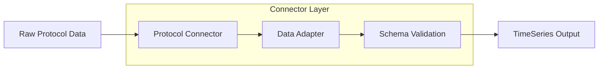

# Qubit Energy Connectors

Protocol-specific connectors for ingesting energy data from various sources into the Qubit Energy platform. These connectors handle the complexity of different communication protocols and translate raw device data into standardized formats.

## Overview

Energy systems communicate using hundreds of different protocols. Qubit Connectors provide a unified interface that abstracts away protocol complexity while maintaining full feature support for each protocol's unique capabilities.

<CardGroup cols={2}>
  <Card title="MQTT" icon="wifi">
    Real-time IoT device telemetry and messaging
  </Card>
  <Card title="OCPP" icon="bolt">
    EV charger communication (1.6J & 2.0.1)
  </Card>
  <Card title="Modbus" icon="gear">
    Industrial equipment and smart meter integration
  </Card>
  <Card title="CSV/API" icon="table">
    Bulk historical data import and REST APIs
  </Card>
</CardGroup>

## Architecture

All connectors follow a consistent architecture pattern:



## Installation

<Tabs>
  <Tab title="Python Package">
    ```bash
    # Install base package
    pip install qubit-energy-connectors

    # With specific protocol support
    pip install qubit-energy-connectors[mqtt]
    pip install qubit-energy-connectors[modbus]
    pip install qubit-energy-connectors[ocpp]
    pip install qubit-energy-connectors[all]
    ```
  </Tab>
  
  <Tab title="Docker">
    ```bash
    # Run MQTT connector
    docker run -d \
      --name qubit-mqtt-connector \
      -e MQTT_BROKER=mqtt://broker.example.com:1883 \
      -e MQTT_TOPICS="+/+/meter/+/readings" \
      qubit/energy-connectors:mqtt

    # Run with configuration file
    docker run -d \
      --name qubit-connectors \
      -v $(pwd)/config.json:/app/config.json \
      qubit/energy-connectors:latest
    ```
  </Tab>
  
  <Tab title="Kubernetes">
    ```yaml
    apiVersion: apps/v1
    kind: Deployment
    metadata:
      name: qubit-mqtt-connector
    spec:
      replicas: 3
      selector:
        matchLabels:
          app: qubit-mqtt-connector
      template:
        metadata:
          labels:
            app: qubit-mqtt-connector
        spec:
          containers:
          - name: connector
            image: qubit/energy-connectors:mqtt-latest
            env:
            - name: MQTT_BROKER
              value: "mqtt://cluster.example.com:1883"
    ```
  </Tab>
</Tabs>

## MQTT Connector

### Features

<AccordionGroup>
  <Accordion title="Protocol Support">
    - **MQTT 3.1.1** and **5.0** support
    - **QoS levels** 0, 1, and 2
    - **TLS/SSL encryption** with certificate validation
    - **WebSocket transport** for browser compatibility
    - **Auto-reconnection** with exponential backoff
  </Accordion>
  
  <Accordion title="Topic Management">
    - **Hierarchical topic structures** (`org/site/asset/device/metric`)
    - **Wildcard subscriptions** (`+` single level, `#` multi-level)
    - **Dynamic topic discovery** and subscription
    - **Topic filtering** and routing rules
  </Accordion>
  
  <Accordion title="Data Processing">
    - **JSON message parsing** with schema validation
    - **Binary payload support** (Protobuf, MessagePack)
    - **Batch message processing** for high throughput
    - **Message deduplication** and ordering
  </Accordion>
</AccordionGroup>

### Configuration

<CodeGroup>

```json Basic Configuration
{
  "mqtt": {
    "broker": "mqtt://broker.example.com:1883",
    "client_id": "qubit_connector_01",
    "topics": [
      "org_001/sit_solar_01/+/+/telemetry",
      "org_001/sit_storage_01/+/+/telemetry"
    ],
    "qos": 1,
    "keepalive": 60
  }
}
```

```json TLS Configuration
{
  "mqtt": {
    "broker": "mqtts://secure-broker.example.com:8883",
    "client_id": "qubit_connector_secure",
    "topics": ["+/+/meter/+/readings"],
    "qos": 2,
    "tls": {
      "ca_certs": "/path/to/ca.pem",
      "certfile": "/path/to/client.crt",
      "keyfile": "/path/to/client.key",
      "insecure": false
    },
    "auth": {
      "username": "${MQTT_USERNAME}",
      "password": "${MQTT_PASSWORD}"
    }
  }
}
```

</CodeGroup>

### Usage Example

```python
from qubit.connectors.mqtt import MQTTConnector
import asyncio

# Configuration
config = {
    "broker": "mqtt://localhost:1883",
    "topics": ["org_001/sit_solar_01/+/+/telemetry"],
    "username": "user",
    "password": "pass"
}

# Data handler
async def handle_solar_data(data):
    """Process incoming solar telemetry."""
    print(f"Solar generation: {data['value']} {data['unit']}")
    
    # Automatically normalized to TimeSeries schema
    timeseries = data.to_timeseries()
    return timeseries

# Main application
async def main():
    connector = MQTTConnector(config)
    
    # Connect and subscribe
    await connector.connect()
    await connector.subscribe(
        "org_001/sit_solar_01/+/+/telemetry",
        handle_solar_data
    )
    
    # Keep running
    await asyncio.sleep(3600)
    
    # Cleanup
    await connector.disconnect()

asyncio.run(main())
```

## OCPP Connector

<Info>
OCPP (Open Charge Point Protocol) is the industry standard for EV charger communication. Qubit supports both OCPP 1.6J and 2.0.1.
</Info>

### Features

- **OCPP 1.6J** and **2.0.1** protocol support
- **WebSocket transport** with automatic reconnection
- **Message queuing** for offline operation
- **Transaction management** with session tracking
- **Smart charging** capabilities
- **Firmware update management**

### Configuration Example

```python
from qubit.connectors.ocpp import OCPPConnector

config = {
    "version": "2.0.1",
    "websocket_url": "wss://chargers.network.com/ocpp",
    "charge_point_id": "CP_001",
    "auth": {
        "basic_auth": {
            "username": "charger_001", 
            "password": "secure_password"
        }
    }
}

connector = OCPPConnector(config)

@connector.on_message("MeterValues")
async def handle_meter_values(message):
    # Convert OCPP message to TimeSeries
    return TimeSeries(
        id=f"ts_{message.charge_point_id}_{message.timestamp}",
        asset_id=message.charge_point_id,
        metric="charging_power",
        value=message.meter_value.sampled_value.value,
        unit="kW",
        timestamp=message.timestamp
    )
```

## Modbus Connector

### Protocol Support

<Tabs>
  <Tab title="Modbus RTU">
    ```python
    config = {
        "protocol": "rtu",
        "port": "/dev/ttyUSB0",
        "baudrate": 19200,
        "parity": "even",
        "stopbits": 1,
        "bytesize": 8,
        "timeout": 1.0
    }
    ```
  </Tab>
  
  <Tab title="Modbus TCP">
    ```python
    config = {
        "protocol": "tcp",
        "host": "192.168.1.100",
        "port": 502,
        "timeout": 5.0,
        "unit_id": 1
    }
    ```
  </Tab>
</Tabs>

### Register Mapping

```json
{
  "modbus": {
    "host": "192.168.1.100",
    "port": 502,
    "registers": {
      "active_power": {
        "address": 40001,
        "type": "float32",
        "scale": 1000,
        "unit": "kW"
      },
      "energy_total": {
        "address": 40003,
        "type": "uint32",
        "scale": 100,
        "unit": "kWh"
      }
    },
    "polling_interval": 5
  }
}
```

## CSV Connector

### Bulk Data Import

```python
from qubit.connectors.csv import CSVConnector

config = {
    "file_path": "/data/historical_generation.csv",
    "mapping": {
        "timestamp": "DateTime",
        "asset_id": "InverterID", 
        "value": "Generation_kWh",
        "unit": "kWh"
    },
    "timestamp_format": "%Y-%m-%d %H:%M:%S",
    "timezone": "America/Los_Angeles"
}

connector = CSVConnector(config)

# Process large files with progress tracking
async def process_historical_data():
    async for timeseries_batch in connector.process():
        print(f"Processed {len(timeseries_batch)} records")
        # Send to Layer 2 for processing
        await layer2_client.send(timeseries_batch)
```

## Monitoring and Observability

<CardGroup cols={2}>
  <Card title="Health Metrics">
    - Connection status and uptime
    - Message throughput and latency
    - Error rates and retry counts
    - Queue depths and processing lag
  </Card>
  <Card title="Data Quality">
    - Schema validation success rates
    - Data completeness metrics
    - Outlier detection and flagging
    - Source reliability scoring
  </Card>
</CardGroup>

### Example Monitoring

```python
from qubit.monitoring import ConnectorMetrics

metrics = ConnectorMetrics()

@connector.on_message
async def track_message_metrics(message):
    metrics.increment_counter("messages_received")
    metrics.record_histogram("message_size", len(message))
    
    # Process message
    result = await process_message(message)
    
    if result.valid:
        metrics.increment_counter("messages_valid")
    else:
        metrics.increment_counter("messages_invalid")
        metrics.record_error("validation_failed", result.error)
```

## Next Steps

<Steps>
  <Step title="Choose Your Protocol">
    Select the connector that matches your energy devices
  </Step>
  <Step title="Configure Connection">
    Set up authentication and connection parameters
  </Step>
  <Step title="Test Integration">
    Start with a small subset of devices to validate data flow
  </Step>
  <Step title="Scale Deployment">
    Deploy across your full device fleet with monitoring
  </Step>
</Steps>

<Card title="Get Started" icon="rocket" href="/layer-1/getting-started">
  Ready to connect your first device? Follow our getting started guide.
</Card>

---

*Qubit Connectors handle the complexity of energy protocols so you can focus on building innovative applications on top of clean, standardized data.*