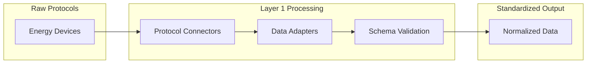

# Layer 1: Data Foundation

Layer 1 forms the bedrock of the Qubit Foundation architecture, establishing universal data standards and providing robust ingestion capabilities for the diverse landscape of energy devices and systems.

## Core Components

<CardGroup cols={3}>
  <Card title="Schemas" icon="database" href="/layer-1/schemas">
    Universal JSON Schema definitions for all energy data types
  </Card>
  <Card title="Connectors" icon="plug" href="/layer-1/connectors">
    Protocol-specific adapters for device communication
  </Card>
  <Card title="Adapters" icon="arrows-rotate" href="/layer-1/adapters">
    Data transformation, normalization, and validation
  </Card>
</CardGroup>

## The Challenge

Energy systems today face massive data fragmentation:

- **1000+** proprietary communication protocols
- **Inconsistent** data formats and units
- **No standards** for device metadata
- **Complex** timezone and measurement handling

Layer 1 solves this by providing a **universal translation layer** that converts any energy data into standardized, validated formats.

## Architecture



## Data Flow

1. **Ingestion**: Connectors receive raw data via native protocols
2. **Adaptation**: Transform units, timezones, and data structures  
3. **Validation**: Ensure data conforms to Qubit Energy Schemas
4. **Output**: Emit standardized TimeSeries objects

## Supported Protocols

<Tabs>
  <Tab title="MQTT">
    **Message Queue Telemetry Transport**
    
    - Real-time IoT device telemetry
    - Hierarchical topic structures
    - QoS levels 0, 1, 2
    - TLS encryption support
    - Auto-reconnection with backoff
    
    **Use Cases**: Solar inverters, smart meters, weather stations
  </Tab>
  
  <Tab title="OCPP">
    **Open Charge Point Protocol**
    
    - EV charger communication
    - Versions 1.6J and 2.0.1 support
    - WebSocket transport layer
    - Message queuing and offline support
    - Transaction and session management
    
    **Use Cases**: Public charging networks, fleet management
  </Tab>
  
  <Tab title="Modbus">
    **Industrial Communication Protocol**
    
    - RTU and TCP variants
    - Register mapping configuration
    - Configurable polling intervals
    - Data type conversion (IEEE floats, integers)
    - Error handling and recovery
    
    **Use Cases**: Industrial meters, PLCs, energy management systems
  </Tab>
  
  <Tab title="CSV/API">
    **Bulk Data Import**
    
    - Historical data import
    - Header mapping configuration
    - Timezone specification
    - Progress tracking for large datasets
    - RESTful API endpoints
    
    **Use Cases**: Utility billing data, historical generation records
  </Tab>
</Tabs>

## Data Standardization

### Universal Schema Format

All data is normalized to the [Qubit Energy Schema](https://github.com/qubit-foundation/qubit-energy-schemas) format:

```json
{
  "id": "ts_solar_farm_001_2024_01_15_14_30",
  "asset_id": "ast_solar_farm_001",
  "metric": "energy_generation",
  "value": 2500.0,
  "unit": "kWh",
  "timestamp": "2024-01-15T14:30:00Z",
  "quality": "good",
  "metadata": {
    "weather_condition": "sunny",
    "panel_temperature": 35.2
  }
}
```

### Supported Data Types

<AccordionGroup>
  <Accordion title="TimeSeries Data">
    - Energy generation/consumption
    - Power measurements
    - Environmental conditions
    - Equipment performance metrics
  </Accordion>
  
  <Accordion title="Asset Information">
    - Device specifications and capabilities
    - Location and installation details
    - Ownership and operational data
    - Maintenance and lifecycle information
  </Accordion>
  
  <Accordion title="Organizational Data">
    - Utility and operator information
    - Customer and billing data
    - Regulatory and compliance metadata
    - Service territory definitions
  </Accordion>
  
  <Accordion title="Event Data">
    - Alarms and fault conditions
    - Maintenance activities
    - Demand response events
    - Grid disturbances
  </Accordion>
</AccordionGroup>

## Performance Specifications

<Info>
Layer 1 is designed for **industrial-scale** energy operations with stringent performance requirements.
</Info>

### Throughput
- **MQTT**: 100,000+ messages/second per instance
- **Modbus**: 10,000+ register reads/second
- **OCPP**: 50,000+ concurrent sessions
- **Batch**: 1TB+ historical data processing

### Latency
- **Real-time protocols**: <10ms end-to-end
- **Batch processing**: <1 second validation
- **Schema validation**: <1ms per record
- **Unit conversion**: <0.1ms per value

### Reliability
- **99.99%** uptime for critical connectors
- **Automatic failover** in <5 seconds
- **Data loss prevention** with persistent queues
- **Graceful degradation** during outages

## Quality Assurance

### Data Validation

Every data point goes through rigorous validation:

1. **Schema Compliance**: Strict JSON Schema validation
2. **Range Checking**: Validate values are within expected ranges
3. **Unit Verification**: Ensure units match measurement types
4. **Timestamp Validation**: Check for reasonable time values
5. **Quality Scoring**: Assign confidence scores to measurements

### Testing Framework

- **Unit Tests**: >95% code coverage
- **Integration Tests**: Real protocol testing
- **Load Tests**: Production-scale performance validation
- **Security Tests**: Penetration testing and vulnerability scanning

## Deployment Options

<CardGroup cols={2}>
  <Card title="Docker Containers">
    Single-node deployment for development and small installations
  </Card>
  <Card title="Kubernetes">
    Production deployment with auto-scaling and high availability
  </Card>
  <Card title="Edge Computing">
    Local processing for latency-sensitive applications
  </Card>
  <Card title="Serverless">
    Event-driven processing for variable workloads
  </Card>
</CardGroup>

## Integration Examples

### Solar Farm Integration

```python
from qubit.connectors.mqtt import MQTTConnector
from qubit.schemas import validate_timeseries

# Configure MQTT connector
config = {
    "broker": "mqtt://solar-farm.example.com:1883",
    "topics": ["farm/inverter/+/telemetry"],
    "tls": {"ca_certs": "/path/to/ca.pem"}
}

connector = MQTTConnector(config)

async def process_solar_data(raw_data):
    # Automatic normalization and validation
    timeseries = connector.normalize(raw_data)
    
    # Schema validation
    validate_timeseries(timeseries)
    
    # Ready for Layer 2 processing
    return timeseries
```

### EV Charging Network

```python
from qubit.connectors.ocpp import OCPPConnector
from qubit.adapters.units import PowerConverter

# OCPP 2.0.1 connector
connector = OCPPConnector(
    version="2.0.1",
    websocket_url="wss://chargers.network.com/ocpp"
)

# Handle charging session data
@connector.on_message("MeterValues")
async def handle_meter_values(message):
    # Convert to standard units
    power_kw = PowerConverter.to_kilowatts(
        message.meter_value.sampled_value.value,
        message.meter_value.sampled_value.unit
    )
    
    # Emit standardized data
    return TimeSeries(
        asset_id=message.charge_point_id,
        metric="charging_power",
        value=power_kw,
        unit="kW",
        timestamp=message.timestamp
    )
```

## Monitoring and Observability

Layer 1 provides comprehensive monitoring capabilities:

- **Metrics**: Throughput, latency, error rates, data quality scores
- **Logging**: Structured logs with correlation IDs
- **Tracing**: Distributed tracing across components
- **Alerting**: Real-time alerts for system health and data quality

## Next Steps

<Steps>
  <Step title="Review Data Standards">
    Understand the [Qubit Energy Schemas](/layer-1/schemas) for your use case
  </Step>
  <Step title="Choose Your Protocol">
    Select the appropriate [connector](/layer-1/connectors) for your devices
  </Step>
  <Step title="Configure Processing">
    Set up [data adapters](/layer-1/adapters) for normalization
  </Step>
  <Step title="Deploy and Monitor">
    Follow the [getting started guide](/layer-1/getting-started) to deploy
  </Step>
</Steps>

---

*Layer 1 provides the foundation for all other layers in the Qubit Foundation stack. By establishing universal data standards and robust ingestion capabilities, it enables the intelligent processing and optimization that powers the energy transition.*