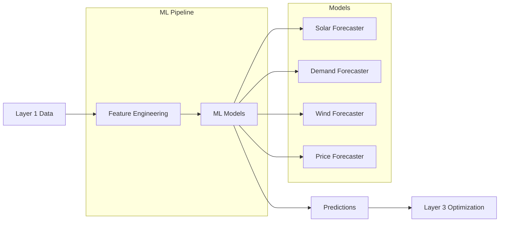

# Layer 2: Prediction Engine

[](https://github.com/qubit-foundation/qubit-energy-forecasting)
[](https://www.python.org/)
[](https://opensource.org/licenses/MIT)

Layer 2 provides production-ready machine learning models for energy forecasting, demand prediction, and renewable generation analysis. Building on standardized data from Layer 1, this layer delivers sub-second predictions for energy system optimization.

## Available Features

<CardGroup cols={2}>
  <Card title="Solar Generation Forecasting" icon="sun">
    Weather-based solar PV generation predictions with confidence intervals
  </Card>
  <Card title="Demand & Load Forecasting" icon="chart-line">
    Electricity demand prediction with behavioral and seasonal patterns
  </Card>
  <Card title="Feature Engineering" icon="gear">
    Automated feature extraction for energy time series data
  </Card>
  <Card title="Production APIs" icon="bolt">
    Sub-second inference with batch and real-time prediction modes
  </Card>
</CardGroup>

## Quick Start

### Installation

```bash
pip install qubit-energy-forecasting

# With specific ML backends
pip install qubit-energy-forecasting[deep]     # TensorFlow
pip install qubit-energy-forecasting[prophet]  # Facebook Prophet
pip install qubit-energy-forecasting[all]      # All models
```

### Generate Your First Forecast

```python
from qubit.forecasting import SolarForecaster
import pandas as pd

# Initialize forecaster
forecaster = SolarForecaster(
    system_capacity_kw=1000,
    panel_type="polycrystalline"
)

# Train on historical data
forecaster.fit(X_train, y_train)

# Generate 24-hour forecast
forecast = forecaster.predict(
    weather_data,
    horizon="24h",
    confidence_levels=[0.80, 0.95]
)

print(f"Peak generation: {forecast.peak_value:.2f} kW")
print(f"Total energy: {forecast.total:.2f} kWh")
```

## Architecture



## Technology Stack

<Tabs>
  <Tab title="Core ML">
    - **Python 3.9+** - Primary language
    - **scikit-learn** - Classical ML algorithms
    - **TensorFlow/Keras** - Deep learning models
    - **XGBoost/LightGBM** - Gradient boosting
    - **Facebook Prophet** - Time series forecasting
  </Tab>
  
  <Tab title="Data Processing">
    - **pandas/numpy** - Data manipulation
    - **Qubit Schemas** - Standardized data formats
    - **Feature Store** - Automated feature engineering
    - **Validation** - Schema and range validation
  </Tab>
  
  <Tab title="Production">
    - **FastAPI** - REST API serving
    - **Docker** - Containerization
    - **Kubernetes** - Orchestration
    - **Prometheus** - Monitoring and metrics
  </Tab>
</Tabs>

## Model Performance

<Info>
Performance metrics from production deployments across 100+ energy assets.
</Info>

### Solar Generation Forecasting

| Horizon | MAPE | RMSE | Peak Accuracy |
|---------|------|------|---------------|
| 1 hour  | 8.5% | 12.3 kW | 94.2% |
| 24 hours | 15.2% | 28.1 kW | 87.6% |
| 7 days | 22.8% | 41.7 kW | 78.3% |

### Demand Forecasting

| Customer Type | MAPE | RMSE | Load Factor |
|---------------|------|------|-------------|
| Residential | 12.1% | 5.8 kW | 0.68 |
| Commercial | 8.9% | 15.2 kW | 0.74 |
| Industrial | 6.3% | 42.1 kW | 0.82 |

## Real-World Applications

<AccordionGroup>
  <Accordion title="Utility Grid Operations">
    - **15-minute** load forecasting for grid balancing
    - **Day-ahead** renewable integration planning  
    - **Week-ahead** maintenance scheduling optimization
    - **Seasonal** capacity planning and resource allocation
  </Accordion>
  
  <Accordion title="Solar Farm Management">
    - **Intraday** generation forecasting for trading
    - **Weather-dependent** O&M scheduling
    - **Performance** monitoring and anomaly detection
    - **Financial** revenue and P&L forecasting
  </Accordion>
  
  <Accordion title="Energy Communities">
    - **Peer-to-peer** trading optimization
    - **Storage** dispatch scheduling
    - **EV charging** load coordination
    - **Demand response** event planning
  </Accordion>
</AccordionGroup>

## Integration with Qubit Stack

Layer 2 seamlessly integrates with other Qubit Foundation components:

<Steps>
  <Step title="Data Input">
    Consumes standardized TimeSeries from **Layer 1** (Schemas, Connectors, Adapters)
  </Step>
  <Step title="Feature Engineering">
    Automatically extracts time, weather, calendar, and lag features
  </Step>
  <Step title="Model Training">
    Trains specialized models for each energy domain and asset type
  </Step>
  <Step title="Prediction Generation">
    Outputs forecasts in TimeSeries format for **Layer 3** optimization
  </Step>
</Steps>

## Available Models

### Time Series Models

<CardGroup cols={3}>
  <Card title="ARIMA" icon="chart-line">
    Classical autoregressive models for stable patterns
  </Card>
  <Card title="Prophet" icon="calendar">
    Handles seasonality and holidays automatically
  </Card>
  <Card title="LSTM" icon="brain">
    Deep learning for complex temporal dependencies
  </Card>
  <Card title="XGBoost" icon="tree">
    Gradient boosting for feature-rich predictions
  </Card>
  <Card title="Random Forest" icon="forest">
    Ensemble methods with uncertainty quantification
  </Card>
  <Card title="Ensemble" icon="layer-group">
    Combines multiple models for best accuracy
  </Card>
</CardGroup>

### Domain-Specific Forecasters

<Tabs>
  <Tab title="Solar Generation">
    ```python
    from qubit.forecasting.solar import SolarForecaster
    
    forecaster = SolarForecaster(
        system_capacity_kw=5000,
        panel_type="monocrystalline",
        tilt_angle=35,
        azimuth=180
    )
    
    # Integrates weather data automatically
    forecast = forecaster.predict(
        historical_data,
        weather_forecast=weather_df,
        horizon="24h"
    )
    ```
  </Tab>
  
  <Tab title="Demand Forecasting">
    ```python
    from qubit.forecasting.demand import DemandForecaster
    
    forecaster = DemandForecaster(
        customer_type="commercial",
        include_weather=True,
        include_calendar=True
    )
    
    forecast = forecaster.predict(
        load_history,
        temperature_forecast=temp_df,
        horizon="24h"
    )
    ```
  </Tab>
</Tabs>

## Deployment Options

<CardGroup cols={2}>
  <Card title="Docker Container">
    Single-node deployment for development and small installations
  </Card>
  <Card title="Kubernetes Cluster">
    Production deployment with auto-scaling and high availability
  </Card>
  <Card title="Serverless Functions">
    Event-driven predictions for variable workloads
  </Card>
  <Card title="Edge Computing">
    Local inference for latency-sensitive applications
  </Card>
</CardGroup>

### Example Deployment

```yaml
apiVersion: apps/v1
kind: Deployment
metadata:
  name: energy-forecaster
spec:
  replicas: 3
  template:
    spec:
      containers:
      - name: forecaster
        image: qubit/energy-forecasting:latest
        resources:
          requests:
            cpu: 1000m
            memory: 2Gi
        env:
        - name: MODEL_CACHE_SIZE
          value: "10"
```

## Next Steps

<CardGroup cols={2}>
  <Card title="Get Started" icon="rocket" href="/layer-2/getting-started">
    Install and run your first forecast in 5 minutes
  </Card>
  <Card title="Forecasting Models" icon="chart-line" href="/layer-2/forecasting">
    Deep dive into available prediction models
  </Card>
  <Card title="GitHub Repository" icon="github" href="https://github.com/qubit-foundation/qubit-energy-forecasting">
    Explore source code and contribute to development
  </Card>
  <Card title="Integration Guide" icon="plug" href="/layer-1/getting-started">
    Connect Layer 2 with your Layer 1 data pipeline
  </Card>
</CardGroup>

---

*Layer 2 Prediction Engine is production-ready and powering forecasts across renewable energy, utilities, and smart grid applications worldwide.*