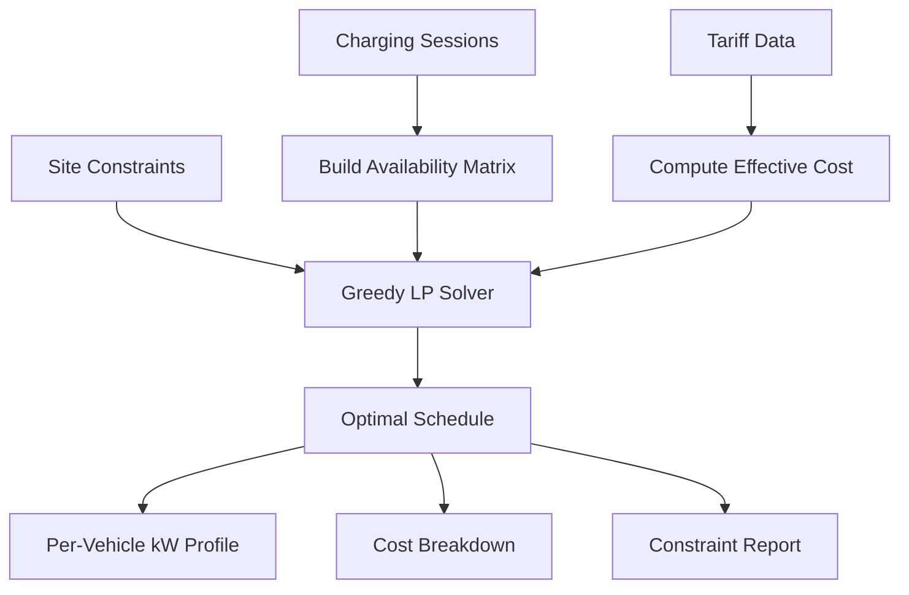

# EV Charging Optimizer

The `EVChargingScheduler` determines the optimal charging power for each vehicle at each time slot, minimizing total energy cost while respecting site capacity, charger limits, vehicle availability, and priority ordering.

## How It Works



The optimizer uses a **greedy LP-relaxation** approach:

1. **Availability matrix** — For each session × time slot, determine if the vehicle is present
2. **Effective cost** — Combine energy price and carbon intensity with configurable weights
3. **Priority ordering** — Process urgent vehicles first, then by earliest departure
4. **Slot filling** — For each vehicle, fill cheapest available slots until energy need is met
5. **Capacity tracking** — Deduct allocated power from remaining site headroom

## Configuration

```python
from optimizer.base import OptimizationConfig
from optimizer.ev.scheduler import EVChargingScheduler

config = OptimizationConfig(
    horizon="24h",       # Scheduling window
    resolution="1h",     # Time slot granularity (supports 15min, 1h)
    objective="minimize_cost",
    weights={
        "cost": 1.0,     # Energy cost weight
        "carbon": 0.0,   # Carbon intensity weight
        "peak": 0.0      # Peak reduction weight
    }
)

scheduler = EVChargingScheduler(
    config=config,
    site_capacity_kw=200.0,    # Max total site power draw
    num_chargers=10,            # Number of charging ports
    charger_capacity_kw=22.0    # Max power per charger (AC Level 2)
)
```

## Charging Sessions

Each EV is described by a `ChargingSession`:

```python
from optimizer.ev.scheduler import ChargingSession
from datetime import datetime, timezone

session = ChargingSession(
    vehicle_id="ev_001",
    arrival_time=datetime(2025, 1, 15, 8, 0, tzinfo=timezone.utc),
    departure_time=datetime(2025, 1, 15, 17, 0, tzinfo=timezone.utc),
    energy_needed_kwh=30.0,        # Energy to deliver
    max_charge_rate_kw=22.0,       # Vehicle onboard charger limit
    min_charge_rate_kw=0.0,        # Minimum (0 = can pause)
    current_soc_percent=20.0,      # Current battery level
    target_soc_percent=80.0,       # Desired departure SOC
    battery_capacity_kwh=60.0,     # Vehicle battery size
    priority=1,                     # 1=normal, 2=high, 3=urgent
    v2g_enabled=False,             # Vehicle-to-grid capable
    max_discharge_rate_kw=0.0      # V2G discharge limit
)
```

### Priority Levels

| Priority | Description | Scheduling Behavior |
|----------|-------------|-------------------|
| 1 | Normal | Scheduled after higher priorities, cost-optimized |
| 2 | High | Preferred slot allocation over normal priority |
| 3 | Urgent | First access to cheapest available slots |

## Tariff Integration

The scheduler natively consumes Qubit tariff schemas:

```python
tariff = {
    "energy_rates": [
        {
            "name": "off_peak",
            "rate": 0.08,
            "schedule": {"start_time": "00:00", "end_time": "06:59"}
        },
        {
            "name": "peak",
            "rate": 0.25,
            "schedule": {"start_time": "07:00", "end_time": "22:59"}
        },
        {
            "name": "off_peak_night",
            "rate": 0.08,
            "schedule": {"start_time": "23:00", "end_time": "23:59"}
        }
    ]
}
```

Tariff schedules support:
- **Time-of-use windows** — `start_time` / `end_time` in HH:MM format
- **Weekday filtering** — `weekdays` array (e.g., `["monday", "tuesday"]`)
- **Monthly filtering** — `months` array (e.g., `[6, 7, 8]` for summer)
- **Carbon intensity** — `carbon_intensity_gco2_kwh` per rate period

## Running an Optimization

```python
import numpy as np

# Multiple vehicles
sessions = [
    ChargingSession(vehicle_id="ev_001", arrival_hour=8, departure_hour=17, energy_needed_kwh=30.0, max_charge_rate_kw=22.0, priority=1),
    ChargingSession(vehicle_id="ev_002", arrival_hour=9, departure_hour=15, energy_needed_kwh=20.0, max_charge_rate_kw=22.0, priority=2),
    ChargingSession(vehicle_id="ev_003", arrival_hour=10, departure_hour=18, energy_needed_kwh=40.0, max_charge_rate_kw=22.0, priority=3),
]

# Optional: background site load and solar generation
load_forecast = np.full(24, 100.0)   # 100 kW constant background load
solar_forecast = np.zeros(24)
solar_forecast[8:17] = 50.0          # 50 kW solar during day

result = scheduler.optimize(
    sessions=sessions,
    tariff=tariff,
    start_time=datetime(2025, 1, 15, 0, 0, tzinfo=timezone.utc),
    load_forecast=load_forecast,
    solar_forecast=solar_forecast
)
```

## Result Structure

The `OptimizationResult` contains:

```python
# Status
result.status           # "optimal" or "feasible"
result.is_optimal       # True if all constraints met
result.solve_time_ms    # Solve time in milliseconds

# Metrics
result.total_cost       # Total energy cost ($)
result.total_energy_kwh # Total energy delivered (kWh)
result.peak_demand_kw   # Maximum net load (kW)
result.carbon_kg        # Total carbon emissions (kg CO2)

# Constraints
result.constraints_satisfied
# {"energy_ev_001": True, "energy_ev_002": True, "site_capacity": True}

# Schedule DataFrame
result.schedule.columns
# ["ev_ev_001_kw", "ev_ev_002_kw", "ev_ev_003_kw",
#  "total_ev_kw", "background_load_kw", "solar_generation_kw",
#  "net_load_kw", "price_per_kwh", "slot_cost"]
```

### Schedule Columns

| Column | Description |
|--------|-------------|
| `ev_{vehicle_id}_kw` | Charging power allocated to each vehicle per slot |
| `total_ev_kw` | Sum of all EV charging power per slot |
| `background_load_kw` | Site background load (from forecast) |
| `solar_generation_kw` | Solar generation (from forecast) |
| `net_load_kw` | Total net load: background + EV - solar |
| `price_per_kwh` | Energy price at each slot |
| `slot_cost` | Cost for each time slot |

## Constraint Enforcement

The scheduler enforces several hard constraints:

<AccordionGroup>
  <Accordion title="Site Capacity">
    Total EV charging power plus background load minus solar never exceeds the site transformer rating. The optimizer tracks remaining headroom at each slot and caps allocation accordingly.
  </Accordion>

  <Accordion title="Charger Capacity">
    Each vehicle's charge rate is capped at the minimum of its onboard charger limit and the EVSE port capacity (`charger_capacity_kw`).
  </Accordion>

  <Accordion title="Vehicle Availability">
    Charging only occurs during the arrival-to-departure window. No power is allocated outside these bounds.
  </Accordion>

  <Accordion title="Energy Delivery">
    The optimizer attempts to deliver the full `energy_needed_kwh` for each session. If constraints prevent this (e.g., too many vehicles competing for limited capacity), the result status changes from "optimal" to "feasible".
  </Accordion>
</AccordionGroup>

## Carbon-Aware Scheduling

Enable carbon-conscious scheduling by adjusting objective weights:

```python
config = OptimizationConfig(
    weights={"cost": 0.5, "carbon": 0.5, "peak": 0.0}
)

tariff = {
    "energy_rates": [
        {"name": "night_clean", "rate": 0.08, "carbon_intensity_gco2_kwh": 200,
         "schedule": {"start_time": "00:00", "end_time": "06:59"}},
        {"name": "day_dirty", "rate": 0.25, "carbon_intensity_gco2_kwh": 450,
         "schedule": {"start_time": "07:00", "end_time": "22:59"}}
    ]
}
```

The effective cost becomes: `0.5 * price + 0.5 * carbon_intensity`, shifting charging toward lower-carbon periods.

## Next Steps

<CardGroup cols={2}>
  <Card title="Peak Shaving" icon="battery-full" href="/layer-3/peak-shaving">
    Combine EV scheduling with battery dispatch for demand management
  </Card>
  <Card title="Getting Started" icon="rocket" href="/layer-3/getting-started">
    Full installation and quickstart guide
  </Card>
</CardGroup>
