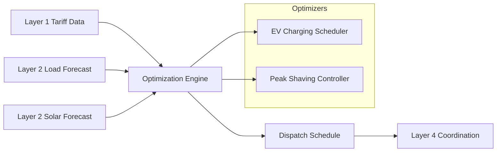

# Layer 3: Optimization Engine

[](https://github.com/qubit-foundation/qubit-energy-optimizer)
[](https://www.python.org/)
[](https://opensource.org/licenses/MIT)

Layer 3 provides mathematical optimization algorithms that determine optimal resource allocation, scheduling, and control strategies for energy systems. Building on forecasts from Layer 2 and tariff data from Layer 1, this layer delivers cost-optimal dispatch schedules in milliseconds.

## Available Features

<CardGroup cols={2}>
  <Card title="EV Charging Optimization" icon="car">
    Fleet charging schedule optimization with tariff-aware, priority-based, carbon-conscious scheduling
  </Card>
  <Card title="Peak Shaving Controller" icon="battery-full">
    Battery dispatch optimization to minimize peak demand and demand charges using a two-pass algorithm
  </Card>
  <Card title="Multi-Objective Optimization" icon="sliders">
    Configurable objective weights for cost, carbon, and peak reduction trade-offs
  </Card>
  <Card title="Tariff Integration" icon="dollar-sign">
    Native consumption of Qubit tariff schemas — time-of-use, demand charges, and carbon intensity
  </Card>
</CardGroup>

## Quick Start

### Installation

```bash
pip install qubit-energy-optimizer
```

### Optimize an EV Charging Schedule

```python
from optimizer.ev.scheduler import EVChargingScheduler, ChargingSession
from optimizer.base import OptimizationConfig
from datetime import datetime, timezone

config = OptimizationConfig(horizon="24h", resolution="1h")
scheduler = EVChargingScheduler(
    config=config,
    site_capacity_kw=200.0,
    charger_capacity_kw=22.0
)

session = ChargingSession(
    vehicle_id="ev_001",
    arrival_time=datetime(2025, 1, 15, 8, 0, tzinfo=timezone.utc),
    departure_time=datetime(2025, 1, 15, 17, 0, tzinfo=timezone.utc),
    energy_needed_kwh=30.0,
    max_charge_rate_kw=22.0,
    priority=1
)

tariff = {
    "energy_rates": [
        {"name": "off_peak", "rate": 0.08, "schedule": {"start_time": "00:00", "end_time": "06:59"}},
        {"name": "peak", "rate": 0.25, "schedule": {"start_time": "07:00", "end_time": "22:59"}},
        {"name": "off_peak_night", "rate": 0.08, "schedule": {"start_time": "23:00", "end_time": "23:59"}}
    ]
}

result = scheduler.optimize(sessions=[session], tariff=tariff)
print(f"Total cost: ${result.total_cost:.2f}")
print(f"Peak demand: {result.peak_demand_kw:.1f} kW")
```

## Architecture



## Technology Stack

<Tabs>
  <Tab title="Core">
    - **Python 3.9+** — Primary language
    - **NumPy / pandas** — Numerical computation and schedule DataFrames
    - **Pydantic** — Configuration validation
    - **Greedy LP** — Cost-sorted slot filling for EV scheduling
    - **Two-pass dispatch** — Peak identification + cheapest-slot charging
  </Tab>

  <Tab title="Data Integration">
    - **Qubit Tariff Schema** — Native TOU, demand charge, and carbon intensity parsing
    - **Layer 2 Forecasts** — Load and solar forecast arrays as direct inputs
    - **Layer 1 IDs** — Asset IDs (`ast_*`) carried through optimization results
  </Tab>

  <Tab title="Constraints">
    - **Site capacity limits** — Total EV load never exceeds transformer rating
    - **Charger capacity** — Per-port max charge rate enforcement
    - **Battery SOC bounds** — Min/max state-of-charge with efficiency modeling
    - **Vehicle availability** — Charge only during arrival-to-departure windows
  </Tab>
</Tabs>

## Optimization Algorithms

### EV Charging — Greedy LP

The EV scheduler uses a greedy linear-programming relaxation:

1. Build an **availability matrix** — which vehicles are present at each time slot
2. Compute **effective cost** per slot — `cost_weight * price + carbon_weight * carbon_intensity`
3. Process sessions by **priority** (urgent first), then **deadline** (earliest departure first)
4. For each session, fill cheapest available slots until energy requirement is met
5. Enforce **site capacity** by tracking remaining headroom at each slot

### Peak Shaving — Two-Pass Dispatch

The peak shaving controller uses a two-pass algorithm:

1. **Pass 1 (Discharge):** Walk forward through time. At each slot where load exceeds the peak target, discharge the battery (respecting SOC limits and max discharge rate)
2. **Pass 2 (Charge):** Calculate total energy discharged, then schedule recharging in the cheapest off-peak slots that have headroom below the peak target

This approach naturally produces schedules that:
- Shave peak demand below the target threshold
- Minimize charging cost by exploiting TOU tariff structure
- Respect all battery physical constraints (SOC, charge/discharge rates, efficiency)
- Account for battery degradation cost

## Integration with Qubit Stack

<Steps>
  <Step title="Data Input">
    Consumes **tariff schemas** from Layer 1 and **forecast arrays** from Layer 2
  </Step>
  <Step title="Optimization">
    Runs cost-optimal scheduling algorithms with configurable objectives and constraints
  </Step>
  <Step title="Schedule Output">
    Produces time-indexed DataFrames with per-slot dispatch commands, SOC profiles, and cost breakdowns
  </Step>
  <Step title="Coordination">
    Outputs feed into **Layer 4** for real-time dispatch and multi-site coordination
  </Step>
</Steps>

## Next Steps

<CardGroup cols={2}>
  <Card title="Get Started" icon="rocket" href="/layer-3/getting-started">
    Install and run your first optimization in 5 minutes
  </Card>
  <Card title="EV Charging" icon="car" href="/layer-3/ev-scheduler">
    Deep dive into fleet charging optimization
  </Card>
  <Card title="Peak Shaving" icon="battery-full" href="/layer-3/peak-shaving">
    Deep dive into battery dispatch for demand reduction
  </Card>
  <Card title="GitHub Repository" icon="github" href="https://github.com/qubit-foundation/qubit-energy-optimizer">
    Explore source code and contribute
  </Card>
</CardGroup>

---

*Layer 3 Optimization Engine is production-ready, powering EV charging fleets and battery dispatch across commercial and industrial energy sites.*
