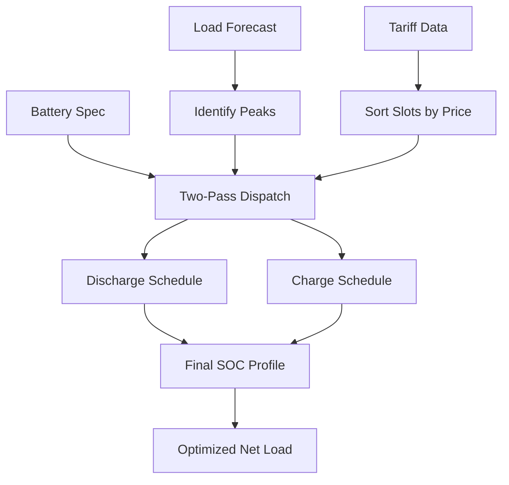

# Peak Shaving Controller

The `PeakShavingController` optimizes battery storage dispatch to reduce peak electricity demand, minimizing demand charges and energy costs. It uses a two-pass algorithm — discharge during peaks, recharge in the cheapest off-peak slots.

## How It Works



### Two-Pass Algorithm

**Pass 1 — Discharge:** Walk forward through each time slot. Wherever the net load exceeds the peak target, discharge the battery to bring it down. Respects SOC minimum, max discharge rate, and round-trip efficiency.

**Pass 2 — Charge:** Total up the energy discharged in Pass 1. Schedule recharging in the cheapest available slots (sorted by tariff price) that have headroom below the peak target. This avoids creating new peaks during charging.

## Battery Specification

```python
from optimizer.peak_shaving.controller import BatterySpec

battery = BatterySpec(
    asset_id="ast_batt_001",
    capacity_kwh=200.0,           # Total battery capacity
    max_charge_kw=50.0,           # Maximum charging power
    max_discharge_kw=50.0,        # Maximum discharging power
    efficiency_charge=0.95,       # One-way charging efficiency
    efficiency_discharge=0.95,    # One-way discharging efficiency
    min_soc_percent=10.0,         # Minimum allowed SOC
    max_soc_percent=90.0,         # Maximum allowed SOC
    initial_soc_percent=50.0,     # Starting SOC
    degradation_cost_per_kwh=0.02 # Battery wear cost per kWh cycled
)
```

### Battery Parameters

| Parameter | Description | Typical Range |
|-----------|-------------|--------------|
| `capacity_kwh` | Nameplate energy capacity | 50–500 kWh |
| `max_charge_kw` / `max_discharge_kw` | C-rate power limits | 0.5C–2C |
| `efficiency_charge` / `efficiency_discharge` | One-way efficiency | 0.90–0.98 |
| `min_soc_percent` / `max_soc_percent` | Usable SOC window | 10–90% |
| `degradation_cost_per_kwh` | Wear cost per kWh cycled | $0.01–0.05 |

## Configuration

```python
from optimizer.base import OptimizationConfig
from optimizer.peak_shaving.controller import PeakShavingController

config = OptimizationConfig(
    horizon="24h",
    resolution="1h"
)

controller = PeakShavingController(
    config=config,
    peak_target_kw=150.0  # Target peak demand threshold
)
```

### Auto-Target Mode

If `peak_target_kw=None`, the controller automatically sets the target to the 80th percentile of the forecast load, shaving the top 20% of peak demand:

```python
controller = PeakShavingController(config=config, peak_target_kw=None)
# Target auto-calculated from load forecast
```

## Running an Optimization

```python
import numpy as np
from datetime import datetime, timezone

# Load profile with morning and evening peaks
hours = np.arange(24)
load = 80 + 100 * np.exp(-((hours - 9) ** 2) / 4) + 120 * np.exp(-((hours - 18) ** 2) / 4)

# Optional: solar generation forecast
solar = np.zeros(24)
solar[8:17] = 60.0  # 60 kW solar during day

# TOU tariff with demand charges
tariff = {
    "energy_rates": [
        {"name": "off_peak", "rate": 0.08, "schedule": {"start_time": "00:00", "end_time": "06:59"}},
        {"name": "peak", "rate": 0.25, "schedule": {"start_time": "07:00", "end_time": "22:59"}},
        {"name": "off_peak_night", "rate": 0.08, "schedule": {"start_time": "23:00", "end_time": "23:59"}}
    ],
    "demand_charges": [
        {"name": "monthly_demand", "rate_per_kw": 15.0, "measurement_period": "monthly"}
    ]
}

result = controller.optimize(
    battery=battery,
    load_forecast=load,
    tariff=tariff,
    solar_forecast=solar,
    start_time=datetime(2025, 1, 15, 0, 0, tzinfo=timezone.utc)
)
```

## Result Structure

```python
# Status
result.status             # "optimal" or "feasible"
result.peak_demand_kw     # Peak net load after optimization
result.total_cost         # Energy cost + battery wear cost

# Savings breakdown
result.constraints_satisfied["peak_reduction_kw"]     # kW reduced
result.constraints_satisfied["cost_savings"]           # $ saved on energy
result.constraints_satisfied["demand_charge_savings"]  # $ saved on demand charges
result.constraints_satisfied["battery_wear_cost"]      # $ battery degradation
```

### Schedule Columns

| Column | Description |
|--------|-------------|
| `load_forecast_kw` | Original load forecast |
| `solar_forecast_kw` | Solar generation forecast |
| `net_load_before_kw` | Net load before battery (load - solar) |
| `battery_charge_kw` | Battery charging power (from grid) |
| `battery_discharge_kw` | Battery discharging power (to site) |
| `battery_soc_kwh` | Battery state of charge in kWh |
| `battery_soc_percent` | Battery state of charge as percentage |
| `net_load_after_kw` | Final net load after battery dispatch |
| `peak_target_kw` | Peak target threshold |
| `price_per_kwh` | Energy price per slot |
| `slot_cost_before` | Energy cost per slot (before optimization) |
| `slot_cost_after` | Energy cost per slot (after optimization) |

## Constraint Enforcement

<AccordionGroup>
  <Accordion title="SOC Bounds">
    The battery SOC never drops below `min_soc_percent` or exceeds `max_soc_percent`. Both charge and discharge are clipped to stay within the usable energy window, accounting for round-trip efficiency losses.
  </Accordion>

  <Accordion title="Charge / Discharge Rate Limits">
    Power is capped at `max_charge_kw` and `max_discharge_kw` at every time slot. The two-pass algorithm naturally respects these limits during both discharge (Pass 1) and charge (Pass 2) phases.
  </Accordion>

  <Accordion title="Peak Target">
    The controller aims to keep net load at or below the target. If the battery is too small to fully shave the peak, the result status is "feasible" rather than "optimal", and the peak is reduced as much as possible.
  </Accordion>

  <Accordion title="No New Peaks">
    During Pass 2 (charging), the algorithm only allocates power up to the headroom between current load and the peak target. This prevents charging from creating new demand peaks.
  </Accordion>
</AccordionGroup>

## Solar Integration

When a solar forecast is provided, the controller works with **net load** (load - solar), which:
- Reduces the effective peak that needs shaving
- Creates more low-cost charging opportunities during solar hours
- Naturally coordinates battery and solar for maximum benefit

```python
result = controller.optimize(
    battery=battery,
    load_forecast=load,
    solar_forecast=solar,   # Reduces net load during solar hours
    start_time=start_time
)

# Net load before battery includes solar offset
midday_net = result.schedule["net_load_before_kw"].iloc[12]  # load - solar
```

## Demand Charge Savings

The controller calculates demand charge savings when `demand_charges` are present in the tariff:

```
demand_charge_savings = (peak_before - peak_after) * rate_per_kw
```

For example, reducing peak from 200 kW to 150 kW with a $15/kW demand charge saves $750/month.

## Next Steps

<CardGroup cols={2}>
  <Card title="EV Charging" icon="car" href="/layer-3/ev-scheduler">
    Combine peak shaving with EV fleet scheduling
  </Card>
  <Card title="Getting Started" icon="rocket" href="/layer-3/getting-started">
    Full installation and quickstart guide
  </Card>
</CardGroup>
