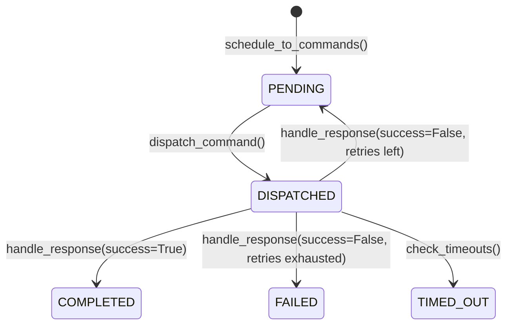

# Dispatch Engine

The `DispatchEngine` is the core bridge between Layer 3's optimization output and Layer 4's command execution. It reads schedule DataFrames and produces a queue of timed `Command` objects, then manages their lifecycle through dispatch, response handling, retries, and timeout detection.

## Schedule-to-Command Conversion

The dispatch engine parses Layer 3 schedule DataFrame columns using naming conventions:

| Column Pattern | Command Type | Asset Type |
|---------------|-------------|-----------|
| `ev_{vehicle_id}_kw` | `SET_CHARGE_RATE` | EV Charger |
| `battery_charge_kw` | `SET_CHARGE_RATE` | Battery |
| `battery_discharge_kw` | `SET_DISCHARGE_RATE` | Battery |

```python
from coordinator import DispatchEngine, EventBus

engine = DispatchEngine(event_bus=EventBus())

# From Layer 3 EV scheduler result
commands = engine.schedule_to_commands(
    result.schedule,
    asset_map={
        "ev_001": "ast_charger_bay_1",
        "ev_002": "ast_charger_bay_2",
        "battery": "ast_batt_001"
    }
)
```

### Change Detection

The engine only emits commands when power values change between consecutive time slots. This avoids flooding assets with redundant setpoints:

```
Hour 8:  22 kW  → Command: SET_CHARGE_RATE 22 kW
Hour 9:  22 kW  → (skipped — same value)
Hour 10: 22 kW  → (skipped — same value)
Hour 11:  0 kW  → Command: SET_CHARGE_RATE 0 kW
```

## Command Lifecycle



### Dispatching Commands

```python
from datetime import datetime, timezone

# Get commands ready for execution
now = datetime.now(timezone.utc)
pending = engine.get_pending_commands(now)

# Dispatch through protocol adapters
for cmd in pending:
    adapter = registry.get(cmd.asset_id)
    engine.dispatch_command(cmd, adapter)
```

### Handling Responses

```python
# Asset acknowledged and executed
engine.handle_response(cmd, success=True)

# Asset reported an error — will retry if under max_retries
engine.handle_response(cmd, success=False, error="connection timeout")
```

### Timeout Detection

```python
# Check for commands stuck in DISPATCHED state
timed_out = engine.check_timeouts(now)
for cmd in timed_out:
    print(f"Command {cmd.command_id} to {cmd.asset_id} timed out")
```

## Command Object

```python
from coordinator.base import Command, CommandType, CommandStatus

cmd = Command(
    asset_id="ast_charger_001",
    command_type=CommandType.SET_CHARGE_RATE,
    parameters={"power_kw": 22.0},
    scheduled_at=datetime(2025, 1, 15, 8, 0, tzinfo=timezone.utc),
    # Auto-generated:
    # command_id="cmd_a1b2c3d4e5f6"
    # status=CommandStatus.PENDING
    # max_retries=3
    # timeout_seconds=30.0
)
```

### Command Types

| Type | Description | Typical Target |
|------|------------|---------------|
| `SET_CHARGE_RATE` | Set charging power | EV charger, battery |
| `SET_DISCHARGE_RATE` | Set discharging power | Battery |
| `SET_POWER_LIMIT` | Set power limit | Any |
| `START_CHARGING` | Begin charging session | EV charger |
| `STOP_CHARGING` | End charging session | EV charger |
| `CHANGE_AVAILABILITY` | Enable/disable asset | EV charger |
| `SET_SOC_TARGET` | Set target SOC | Battery |

## Event Publishing

The dispatch engine publishes events at each lifecycle transition:

| Action | Event Type |
|--------|-----------|
| Commands generated | `SCHEDULE_RECEIVED` |
| Command sent | `COMMAND_DISPATCHED` |
| Command succeeded | `COMMAND_COMPLETED` |
| Command failed | `COMMAND_FAILED` |
| Command timed out | `COMMAND_TIMED_OUT` |

```python
# Monitor all dispatched commands
bus.subscribe(EventType.COMMAND_DISPATCHED, lambda e: log.info(
    f"Dispatched {e.payload['command_type']} to {e.payload['asset_id']}"
))
```

## Lookup Methods

```python
# Find a specific command
cmd = engine.get_command("cmd_a1b2c3d4e5f6")

# Get all commands for an asset
asset_cmds = engine.get_commands_for_asset("ast_charger_001")
```
