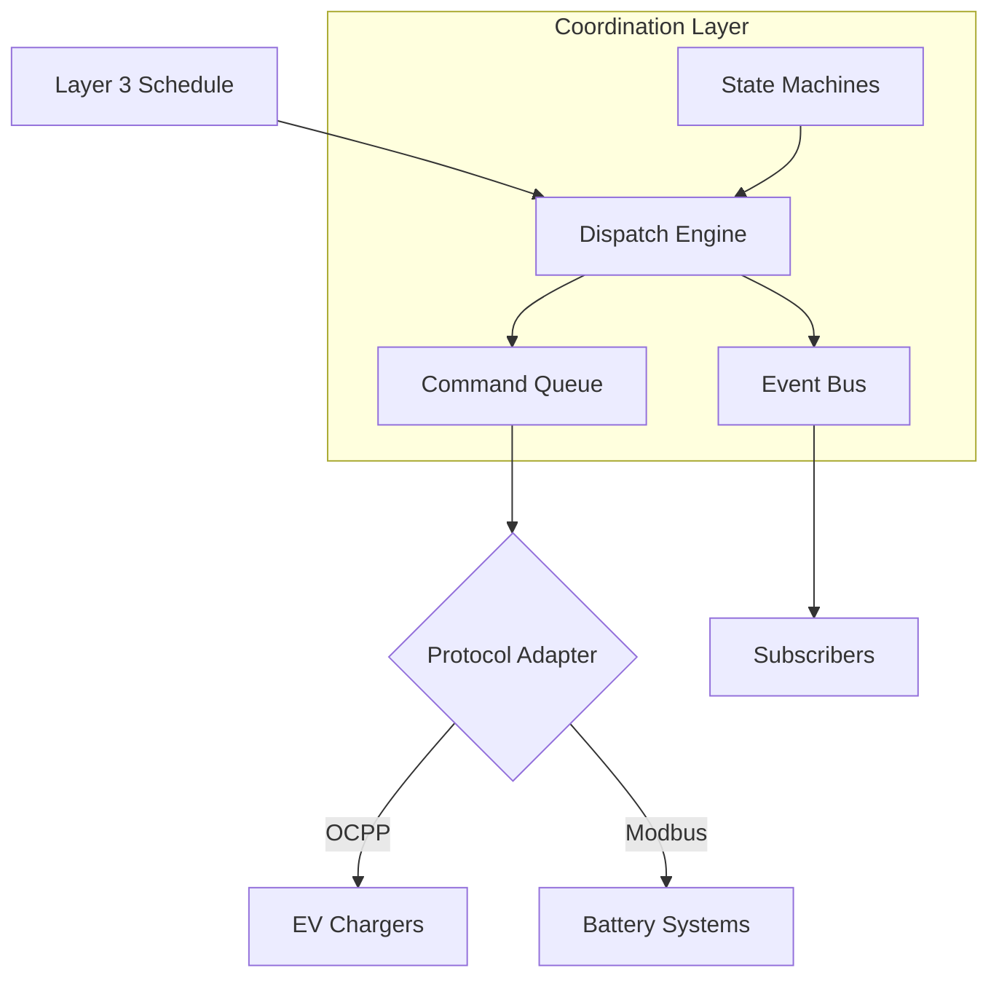

# Layer 4: Coordination Engine

[](https://github.com/qubit-foundation/qubit-energy-coordinator)
[](https://www.python.org/)
[](https://opensource.org/licenses/MIT)

Layer 4 bridges the gap between Layer 3's optimization schedules and real-world energy assets. It converts time-indexed dispatch plans into device-specific commands, manages asset state lifecycles, and provides event-driven coordination across the system.

## Available Features

<CardGroup cols={2}>
  <Card title="Dispatch Engine" icon="paper-plane">
    Converts Layer 3 OptimizationResult schedules into timed commands with lifecycle tracking and retry logic
  </Card>
  <Card title="State Machines" icon="diagram-project">
    OCPP-aligned EV charger and battery state machines with transition guards and event publishing
  </Card>
  <Card title="Protocol Adapters" icon="plug">
    OCPP adapter for EV chargers, Modbus adapter for batteries, with an extensible registry pattern
  </Card>
  <Card title="Event Bus" icon="bell">
    Typed synchronous pub/sub system for real-time coordination events across all components
  </Card>
</CardGroup>

## Quick Start

### Installation

```bash
pip install qubit-energy-coordinator
```

### Dispatch an Optimization Schedule

```python
from coordinator import DispatchEngine, EventBus, OCPPAdapter, AdapterRegistry

# Set up infrastructure
bus = EventBus()
registry = AdapterRegistry()
registry.register("ast_ev_001", OCPPAdapter("ocpp_site_1"))

engine = DispatchEngine(event_bus=bus, adapter_registry=registry)

# Convert a Layer 3 schedule to commands
commands = engine.schedule_to_commands(
    optimization_result.schedule,
    asset_map={"ev_001": "ast_ev_001"}
)

# Dispatch pending commands
for cmd in engine.get_pending_commands(now):
    adapter = registry.get(cmd.asset_id)
    engine.dispatch_command(cmd, adapter)
```

## Architecture



## Core Components

### Dispatch Engine

The central orchestration component. It reads an `OptimizationResult.schedule` DataFrame (from Layer 3) and produces timed `Command` objects:

- **EV columns** (`ev_{vehicle_id}_kw`) become `SET_CHARGE_RATE` commands
- **Battery columns** (`battery_charge_kw`, `battery_discharge_kw`) become `SET_CHARGE_RATE` / `SET_DISCHARGE_RATE` commands
- Only emits commands on value changes (avoids redundant setpoints)
- Tracks command lifecycle: `PENDING → DISPATCHED → COMPLETED` (or `FAILED` / `TIMED_OUT`)
- Automatic retry with configurable backoff

### State Machines

Generic finite state machine with energy asset presets:

<Tabs>
  <Tab title="EV Charger">
    OCPP-aligned lifecycle with 7 states:

    ```
    AVAILABLE → PREPARING → CHARGING → FINISHING → AVAILABLE
                    ↕           ↕
                SUSPENDED   FAULTED
                              ↕
                          UNAVAILABLE
    ```

    Triggers: `plug_in`, `start_charge`, `suspend`, `resume`, `complete`, `unplug`, `fault`, `reset`, `disable`, `enable`
  </Tab>

  <Tab title="Battery">
    5-state battery management:

    ```
    IDLE ↔ CHARGING ↔ DISCHARGING
      ↕
    STANDBY    FAULTED
    ```

    Supports direct mode switching (charge → discharge without stopping). Triggers: `charge`, `discharge`, `stop`, `standby`, `activate`, `fault`, `reset`
  </Tab>
</Tabs>

### Protocol Adapters

Translate abstract commands into device-specific payloads:

<Tabs>
  <Tab title="OCPP (EV Chargers)">
    Maps command types to OCPP 1.6/2.0 actions:

    | Command Type | OCPP Action |
    |-------------|-------------|
    | `SET_CHARGE_RATE` | `SetChargingProfile` |
    | `START_CHARGING` | `RemoteStartTransaction` |
    | `STOP_CHARGING` | `RemoteStopTransaction` |
    | `CHANGE_AVAILABILITY` | `ChangeAvailability` |

    Generates complete OCPP JSON payloads including charging profiles with power limits in watts.
  </Tab>

  <Tab title="Modbus (Batteries)">
    Maps commands to Modbus register writes:

    | Command Type | Default Register |
    |-------------|-----------------|
    | `SET_CHARGE_RATE` | 40001 |
    | `SET_DISCHARGE_RATE` | 40002 |
    | `SET_POWER_LIMIT` | 40003 |
    | `SET_SOC_TARGET` | 40004 |

    Custom register maps supported per deployment.
  </Tab>
</Tabs>

### Event Bus

Typed synchronous pub/sub with 8 event types:

```python
from coordinator import EventBus, EventType

bus = EventBus()

# Subscribe to state changes
bus.subscribe(EventType.STATE_CHANGED, lambda e: print(
    f"Asset {e.payload['asset_id']}: {e.payload['from_state']} → {e.payload['to_state']}"
))

# Subscribe to command failures for alerting
bus.subscribe(EventType.COMMAND_FAILED, lambda e: alert_oncall(e.payload))
```

Event types: `COMMAND_CREATED`, `COMMAND_DISPATCHED`, `COMMAND_ACKNOWLEDGED`, `COMMAND_COMPLETED`, `COMMAND_FAILED`, `COMMAND_TIMED_OUT`, `STATE_CHANGED`, `SCHEDULE_RECEIVED`

## Integration with Qubit Stack

<Steps>
  <Step title="Receive Schedule">
    Layer 3 produces an `OptimizationResult` with a schedule DataFrame containing per-asset power setpoints
  </Step>
  <Step title="Generate Commands">
    `DispatchEngine.schedule_to_commands()` parses the DataFrame columns and creates timed `Command` objects
  </Step>
  <Step title="Validate State">
    State machines are checked before dispatch — commands to faulted or unavailable assets are held
  </Step>
  <Step title="Translate Protocol">
    The `AdapterRegistry` finds the correct protocol adapter and translates the command to device-specific format
  </Step>
  <Step title="Dispatch & Track">
    Commands are sent to assets, responses tracked, and events published for monitoring and re-optimization triggers
  </Step>
</Steps>

## Next Steps

<CardGroup cols={2}>
  <Card title="Get Started" icon="rocket" href="/layer-4/getting-started">
    Install and dispatch your first schedule in 5 minutes
  </Card>
  <Card title="Dispatch Engine" icon="paper-plane" href="/layer-4/dispatch">
    Deep dive into schedule-to-command conversion and lifecycle management
  </Card>
  <Card title="State Machines" icon="diagram-project" href="/layer-4/state-machines">
    EV charger and battery state machine details
  </Card>
  <Card title="Protocol Adapters" icon="plug" href="/layer-4/protocol-adapters">
    OCPP, Modbus, and custom adapter development
  </Card>
  <Card title="GitHub Repository" icon="github" href="https://github.com/qubit-foundation/qubit-energy-coordinator">
    Explore source code and contribute
  </Card>
</CardGroup>

---

*Layer 4 Coordination Engine bridges optimization intelligence with physical energy assets, enabling real-time dispatch and control.*
