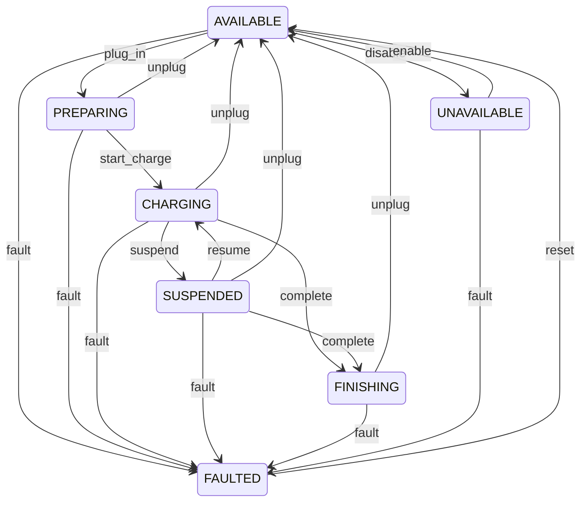
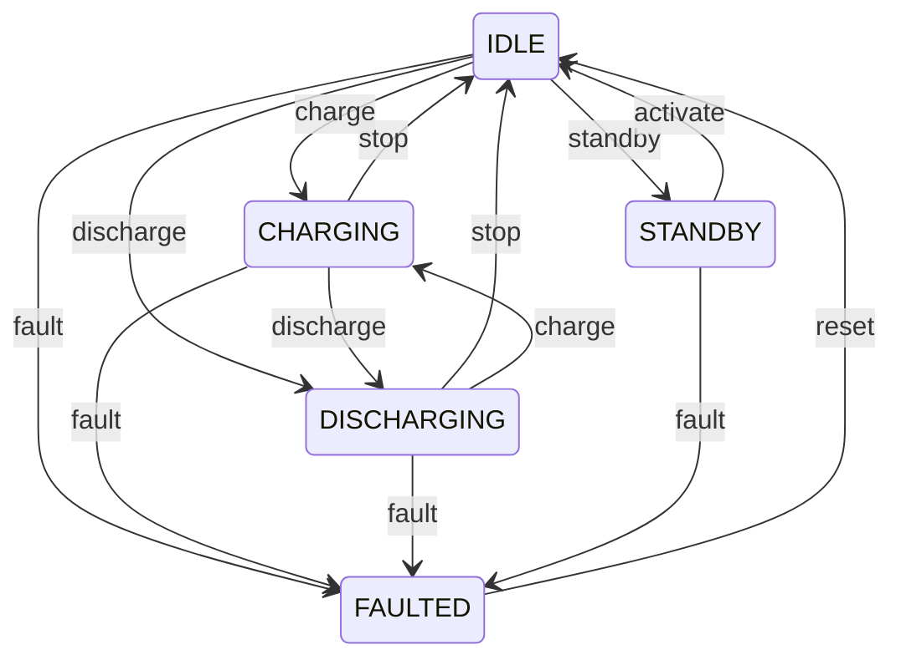

# State Machines

The coordination layer uses finite state machines to track and guard asset lifecycles. Each controllable asset has a state machine instance that ensures commands are only dispatched when the asset is in a valid state.

## Generic State Machine

The `StateMachine` class is a reusable, configurable FSM:

```python
from coordinator import StateMachine, EventBus

sm = StateMachine(
    asset_id="ast_custom_001",
    states={"OFF", "STARTING", "RUNNING", "STOPPING"},
    initial_state="OFF",
    transitions={
        "OFF": {"start": "STARTING"},
        "STARTING": {"ready": "RUNNING", "fail": "OFF"},
        "RUNNING": {"stop": "STOPPING"},
        "STOPPING": {"stopped": "OFF"},
    },
    event_bus=EventBus()  # Optional
)

sm.trigger("start")        # → "STARTING"
sm.can_trigger("ready")    # → True
sm.available_triggers()    # → ["ready", "fail"]
```

### Transition Guards

Invalid transitions raise `InvalidTransition` with diagnostic info:

```python
from coordinator import InvalidTransition

try:
    sm.trigger("stop")  # Not valid from STARTING
except InvalidTransition as e:
    print(e.current_state)     # "STARTING"
    print(e.trigger)           # "stop"
    print(e.valid_triggers)    # ["ready", "fail"]
```

### History Tracking

Every transition is recorded:

```python
sm.trigger("start")
sm.trigger("ready")
print(sm.history)
# [{"from_state": "OFF", "to_state": "STARTING", "trigger": "start", "timestamp": ...},
#  {"from_state": "STARTING", "to_state": "RUNNING", "trigger": "ready", "timestamp": ...}]
```

## EV Charger State Machine

OCPP-aligned lifecycle with 7 states:



```python
from coordinator import create_ev_charger_state_machine

charger = create_ev_charger_state_machine("ast_charger_001")

charger.trigger("plug_in")       # AVAILABLE → PREPARING
charger.trigger("start_charge")  # PREPARING → CHARGING
charger.trigger("complete")      # CHARGING → FINISHING
charger.trigger("unplug")        # FINISHING → AVAILABLE
```

### Key Scenarios

<AccordionGroup>
  <Accordion title="Normal Charging Session">
    `AVAILABLE → PREPARING → CHARGING → FINISHING → AVAILABLE`

    The happy path: vehicle plugs in, charging starts, completes, vehicle unplugs.
  </Accordion>

  <Accordion title="Suspended Charging">
    `CHARGING → SUSPENDED → CHARGING`

    Charging paused (e.g., grid signal, user request) then resumed.
  </Accordion>

  <Accordion title="Early Departure">
    `CHARGING → AVAILABLE` (via `unplug`)

    Vehicle unplugs before charging completes. The dispatch engine should detect this and mark remaining commands as cancelled.
  </Accordion>

  <Accordion title="Fault Recovery">
    `Any State → FAULTED → AVAILABLE` (via `reset`)

    Hardware fault detected. After reset, charger returns to available.
  </Accordion>
</AccordionGroup>

## Battery State Machine

5-state battery management with direct mode switching:



```python
from coordinator import create_battery_state_machine

battery = create_battery_state_machine("ast_batt_001")

battery.trigger("charge")     # IDLE → CHARGING
battery.trigger("discharge")  # CHARGING → DISCHARGING (direct switch)
battery.trigger("stop")       # DISCHARGING → IDLE
```

### Direct Mode Switching

The battery state machine supports direct transitions between charging and discharging without requiring a stop in between. This enables the dispatch engine to switch modes immediately when the optimization schedule transitions from charge to discharge.

## Event Bus Integration

All state machines can publish `STATE_CHANGED` events:

```python
from coordinator import EventBus, EventType, create_battery_state_machine

bus = EventBus()
bus.subscribe(EventType.STATE_CHANGED, lambda e: print(
    f"{e.payload['asset_id']}: {e.payload['from_state']} → {e.payload['to_state']}"
))

battery = create_battery_state_machine("ast_batt_001", event_bus=bus)
battery.trigger("charge")
# Prints: ast_batt_001: IDLE → CHARGING
```
